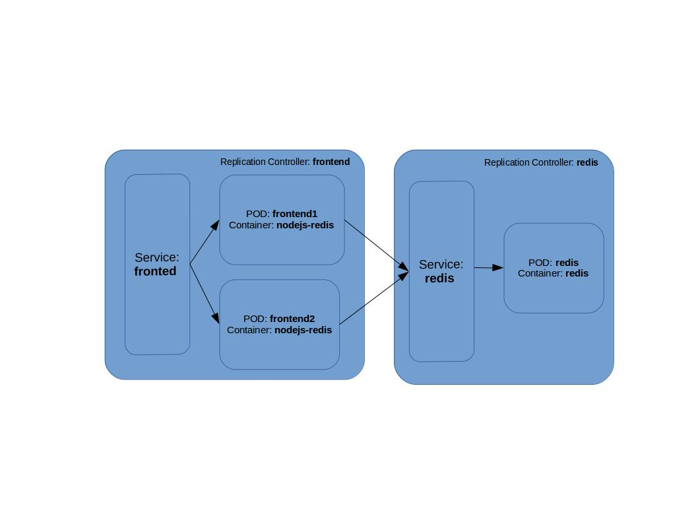

# Welcome to the Locator-Service API

## Overview
The Locator-Service API is an endpoint that will allow you to provide a longitude, latitude, radius and entity type and will return a list of all those entity types within the radius from the location.

This API uses a 'Cache-Aside' pattern to return API data matching the query. E.g try to read the data from Redis and return directly if found.  If data is not present, then query the Google Maps API and then store result in Redis before returning result to the client.

We also built a small Web App to showcase this.

## Architecture Overview

We initially chose AWS as our cloud platform but as we had some issue installing/ configuring Kubernetes, we ended up switching to Google Cloud Platform which proved much easier.

The diagram below shows our overall architecture:



## Technology Components

- Cloud Provider - Google Cloud Platform
- Deployment - Docker images using Kubernetes
- In Built Load Balancer (LB)
- App Platform - Node.js
- Caching - Redis

## Architecture Description
In the architecture we tried to use the cloud providers built in capabilities where possible. For Google, this includes Redis service LB.  To provide a potentially scalable solution we can scale out each tier as required, but have not done this due to "free" cloud restrictions.

### Cloud Provider - Google Cloud Platform

### Deployment - Docker images using Kubernetes

Docker image is built and pushed to the google cloud registry.
Docker image name: gcr.io/my-kubernetes-test-152405/store-locator:v2

Deployment is done using the Replication Controller feature of Google Cloud Platform. For each of the components (nodejs and redis) separate Replication Controllers and corresponding services are created. Service for redis does not have public ip, where as for nodejs service has the public IP configured. 

### Load Balancer

Load Balancer is created by exposing external IP address for the frontend service which nodejs application.

### App Platform - Node.js

Nodejs application uses these packages & apis:
express -- For rest server
redis -- For redis client
Google Places API -- For retrieving the entities from google by providing the lat/lng and radius.
Google Map API -- For rendering the entities on Google Map.

### Caching - Redis

Cache-aside pattern is used for retrieving data from Redis. On receving locator request, first redis is looked for the data and if data exists then it is returned immediately. On Redis cache miss it is retrieved from Google API and populted to redis. Redis GEO commands are used to retrieve the data based on lat/lng and radius.

## API Contract

- Inputs
  - latitude   (origin)
  - longitude  (origin)
  - entity type
  - radius to search
- Output (Array of)
  - id for the entity
  - name of entity
  - latitude of entity
  - longitude of entity
  - icon representing the entity


Example JSON output:

```
[
  {
    "id": "8bcbe06e54aee1530f383ff96c83f5d9bbaee54d",
    "name": "Hurricane's Grill Darling Harbour",
    "lat": -33.87073569999999,
    "lng": 151.1989809,
    "icon": "https://maps.gstatic.com/mapfiles/place_api/icons/restaurant-71.png"
  },
  {
    "id": "6237ce126ba1afabd5985b059d3d1eca6e9ee0da",
    "name": "Blue Fish",
    "lat": -33.871241,
    "lng": 151.199087,
    "icon": "https://maps.gstatic.com/mapfiles/place_api/icons/restaurant-71.png"
  }
]
```


## Running the Demo

Access following URL which provides the UI for the Locator Service where Latitude, Longitude, Distance and Entity Type (i.e., restaurants, foods).

   [Application URL](http://35.184.17.6:8090/locatorui)
   
Access following REST API URL of Locator Service where Latitude, Longitude, Distance and Entity Type (i.e., restaurant, food) are provided as query string. Only clicking Apply map will display the results.
Example: Latitude: -33.8708202
         Longitude: 151.1994884
         Distance: 1000
         Entity Type: restaurant

  [REST Endpoint URL](http://35.184.17.6:8090/locator?lat=-33.8708202&long=151.1994884&distance=500&entity_key=restaurant)

## Source code

- [Docker Image](docker-image)

  Contains the docker image and instructions on how to deploy to Google Cloud.

- [Node Components](node-server)

  Contains the node components which provide both the API and Web App.


## Issues/ TODO

* Issue 1 - When request is sent for a particular lat/lng for first time, empty response is returned. On subsequent request for same lat/lng exact results will be displayed.

